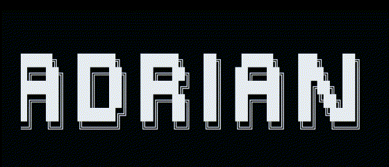

  

## &nbsp;_About Me_
<ul>
  <li> 💻 <em><strong>Computer Science</strong></em> student at the <strong>University of Engineery and Technology</strong></li>
  <li> 🧱 Resident in V.E.S, Lima, Perú</li>
  <li> 👀 Interested in <em>Software Development</em> and <em>Artificial Intelligence</em>.</li>
  <li> ✨ Collaborating as <em>Frontend Developer</em> in &nbsp;  &nbsp;.</li>
  <li> 🫱🏻 Contact me: &nbsp;  &nbsp; or &nbsp;  &nbsp;.</li>
<!--   <li> 🌱 Currently working as ... </li> -->
</ul>

## &nbsp;_Github Stats 📈_

   &nbsp;&nbsp;
  &nbsp;&nbsp;&nbsp;&nbsp;
<!--    -->
<!--    -->

## &nbsp;_Tech Stack 💡_

  
  
  
  
  
  
  
  
  
  
  
<!--   
   -->

  
  
  
  
  
<!--   
   -->
  
  
<!--   
   -->
<!--   
   -->
  
  

  
  
  
  
  
<!--   
   -->
<!--   
   -->

  
  
  
<!--   
   -->
<!--   
   -->
  
  

  
  
  
<!--   
   -->
  
<!--   
   -->
  
  
  
  
  
  
  

<!--  

  
  
  
  
  
  
  
  
  

 -->
